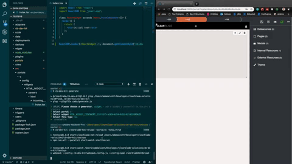

# Clearblade Hot Reload

## Overview

Clearblade Hot Reload provides an application allowing any changes made to an exported ClearBlade system's portal inside of a code editor to update the portal in real time when the file is saved.

**Highly Recommended**\
Use ClearBlade Hot Reload integration with [CB Dev Kit](https://github.com/ClearBlade/cb-dev-kit) CLI development tool.



## Applications
Clearblade Hot Reload applies to any file changes inside the portal's config directory, including:
* Portal Config 
  * \<portalname>.json
* Datasources
  * meta.json
  * parser.js
* Internal Resources
  * \<filename>.json
  * meta.json
* Widgets
  * parsers
    * / \* / \* /index.js
  * meta.json
  * settings.json


## Prereqs

`ClearBlade Platform System` - A system created in a ClearBlade Platform, such as platform.clearblade.com

`ClearBlade Portal` - A dashboard for custom visualizations with preconfigured integrations with the ClearBlade System to which it belongs. See [ClearBlade's documentation](https://docs.clearblade.com/v/4/portal/) for more information.


## Setup

1. If you haven't already, export your system to your local environment using:
  * [ClearBlade Developer Console](https://docs.clearblade.com/v/4/console/) or 
  * [cb-cli tool](https://github.com/ClearBlade/cb-cli#export):
  ```
  cb-cli export
  ```

2. Verify your portal can be found within the portals directory in your exported system

3. Grant clearblade-hot-reload message topic permissions to role(s) you would like to grant portal development access to. Roles' permissions can be updated in the Roles section of the [ClearBlade Developer Console](https://docs.clearblade.com/v/4/console/).
* Individual portal topic name:\
`clearblade-hot-reload/portals/<portalname>`, or
* All portals topic name:\
`clearblade-hot-reload/#` for access to all portals


## Usage

1. Install globally if you will be using package on multiple systems (recommended) or install locally to system directory
```
npm i -g @clearblade/clearblade-hot-reload
```
or
```
npm i --save-dev @clearblade/clearblade-hot-reload
```

2. Initialize ClearBlade Hot Reload from within the portal by clicking the icon (displayed below) at the top right of the Dev console on the right side. A success notification should display, else check the console for information on any errors.


3. Initialize the hot reload server from the local system directory.\
Note: this will only begin watching for changes made to the \<systemname>/portals/\<portalname>'s directory. If wanting to integrate with cb-dev-kit for integration with webpack/babel transpilation using a src directory, see [CB Dev Kit](https://github.com/ClearBlade/cb-dev-kit).
```
clearblade-hot-reload start
```

|Flag|Overview|Example|
|---|---|---|
|portal|Portal name|-portal=\<portalName>|
|messagePort|Should be set to the same -messagePort the console is running on. Defaults to 1883.|-messagePort=1884|
|noSSL|Disables SSL for non-TLS connections on local systems. If on a production system with TLS enabled, ignore this flag and set -messagePort to 1884|-noSSL=true|
|caPath|If pointing at a production system and your certificate authority is not DigiCert, you must use -caPath to provide the absolute path of your CA.|-caPath=/\*/\*/*/ca.pem|


